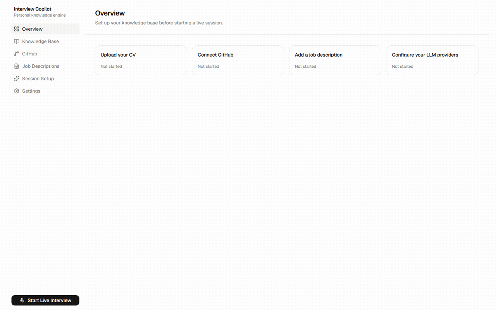
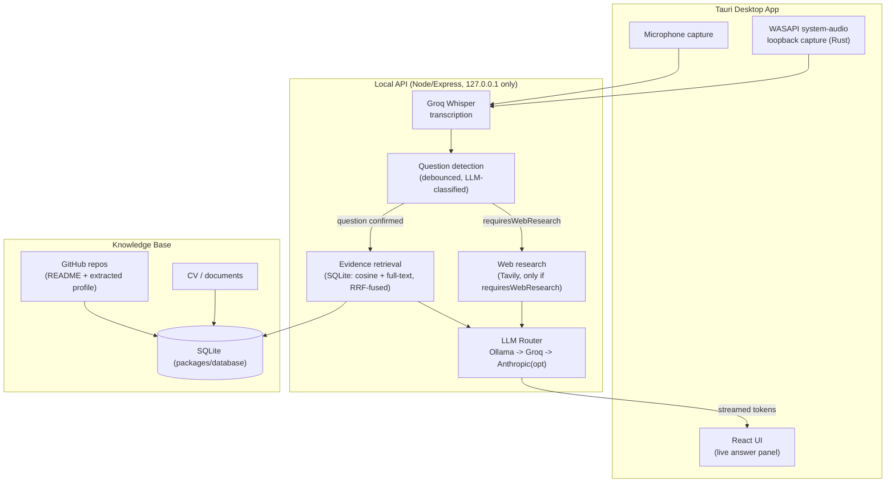
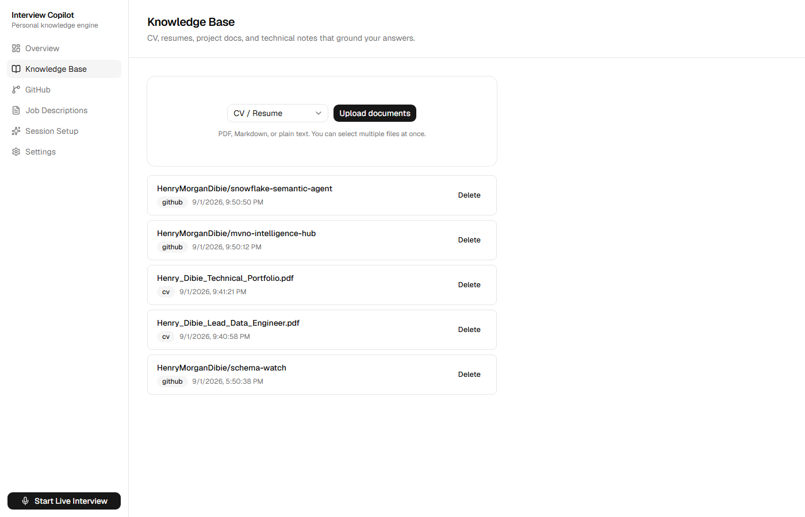
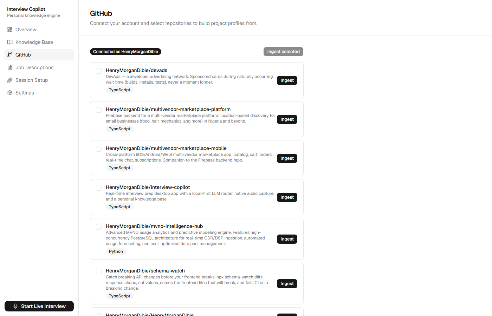
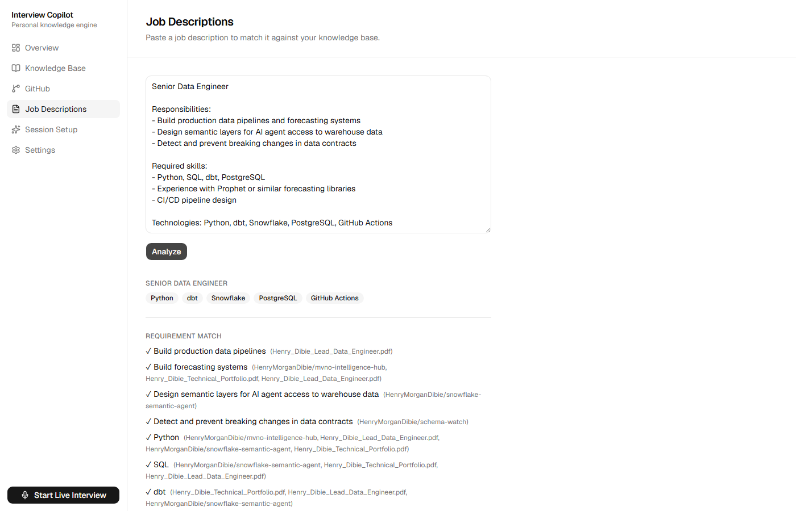
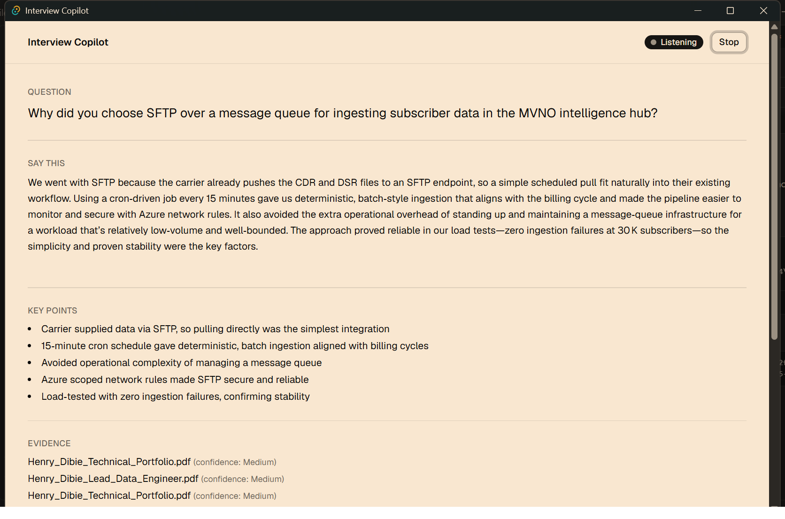

# Interview Copilot

**It never fabricates experience you don't have.** That's the actual engineering constraint this project is built around, enforced in code (see [grounding policy](#grounding-policy)) and checked against a real evaluation harness (see [evaluation](#evaluation)) — not just a prompt asking nicely.

Interview Copilot is a local-first AI system for **interview preparation and simulated interview practice**: it listens to a mock or explicitly-permitted interview, detects when the interviewer has asked a real question, retrieves your strongest relevant evidence from your own CV and GitHub projects, and generates a concise answer grounded in what you've actually done.

[](https://github.com/HenryMorganDibie/interview-copilot/releases/latest)
[-000000?style=for-the-badge&logo=apple&logoColor=white)](https://github.com/HenryMorganDibie/interview-copilot/releases/latest)

Windows is the fully-verified platform (see the rest of this README for what's actually been tested). The macOS build is Apple Silicon only, mic-only (no interviewer-audio capture yet), and hasn't been run on real Mac hardware — see [Platform support](#platform-support) before relying on it. **Downloading the installer alone isn't enough yet** — the backend still needs to be run from a real clone of this repo; see the callout in [Setup](#setup).



*The full loop, all real app, real data, real output — no mockups: (1) the knowledge base with Henry's real CVs and GitHub repos ingested, (2) a real job posting ("Python/AI Evaluation Trainer") pasted in and matched against that knowledge base — every requirement hit, with the actual source cited, (3) a live interview answer streaming in, grounded in real CV evidence. That live-session frame is from a full 7-question mock-interview rehearsal for an actual role; three earlier versions of it showed the interviewer's audio garbled, hallucinated, or missing its first words entirely — real bugs, not a feature — see [below](#interviewer-audio-accuracy-and-latency) for the full account of what was actually wrong and how each was found.*



## What this is (and isn't)

This is built for **rehearsing answers grounded in your real experience** before a real interview, or for use in contexts where AI assistance during an interview is explicitly permitted — not for covertly answering a live interview where AI use isn't disclosed. The core engineering constraint — never fabricate experience you don't have — exists specifically because misrepresenting your background, AI-assisted or not, is the actual failure mode this project treats as unacceptable. See the [grounding policy](#grounding-policy) below for how that's enforced in code, not just prompted for.

## Grounding policy

1. Personal claims must come from your own knowledge base (CV, GitHub projects) — never invented.
2. The model may synthesize phrasing, but not invent experience, outcomes, or metrics that aren't in the source material.
3. Missing evidence → the answer says so plainly rather than guessing (verified in [evaluation](docs/eval/RESULTS.md): 0/3 no-evidence test questions fabricated a claim).
4. External/current facts (e.g. "what's new in Next.js") go through web research, gated by the question analyzer's `requiresWebResearch` flag — not asked on every question.
5. Web research never gets blended into personal evidence: retrieval always runs, but a question the analyzer flags as non-personal has to clear a higher evidence bar, so a current-events answer can't accidentally cite an unrelated CV line as a "source."

This is enforced in code: `packages/knowledge`'s evidence retrieval and `apps/api`'s `/api/answer` route both consult the question analyzer's output, and every "source" attached to an answer is built from the app's own retrieval — never trusted from client input. Two real bugs in this logic were found and fixed by actually running an evaluation, not by inspection — see [`docs/eval/RESULTS.md`](docs/eval/RESULTS.md) for the details, including a fix that initially over-corrected and was caught by a second independent eval run.

## How it works

1. **Prep, before the interview**: upload your CV, connect GitHub and select repos to ingest, optionally paste a job description for requirement matching and likely-question prep.
2. **Session setup**: pick a response mode — **Direct** (a full 3-6 sentence spoken answer), **Talking Points** (3-5 short bullet fragments to speak from in your own words), or **Follow-up** (a terse 1-2 sentence answer for a quick clarifying question).
3. **During the interview**: click Start Listening. Your microphone and your system's audio output (whatever the interviewer's voice is playing through — Zoom, Google Meet, anything) are both transcribed in real time.
4. When the interviewer finishes a question (detected via a debounce + LLM classification, not fired on every audio fragment), the app retrieves your most relevant real evidence and streams a grounded answer, in the response mode you picked, for you to read.

## Screenshots

| Knowledge Base | GitHub ingestion |
|---|---|
|  |  |

| Job description matching | Live interview |
|---|---|
|  |  |

## Evaluation

Measured against the real running app (not fabricated numbers) — see [`docs/eval/RESULTS.md`](docs/eval/RESULTS.md) for the full writeup, methodology, and every real bug it's caught before shipping. The harness itself (`docs/eval/run-eval.mjs`) is part of this repo, not a private benchmark — run it against your own knowledge base and question sets to check these claims yourself:

```bash
node docs/eval/run-eval.mjs docs/eval/eval-set.json docs/eval/detection-set.json docs/eval/results.json
```

| Metric | Result |
|---|---:|
| Question detection accuracy | 91.7%–100% (2026-09-05 re-runs) |
| Retrieval hit rate (known-source questions) | 88.9% (hybrid semantic + BM25-like search, see below) |
| No-evidence questions correctly declined (not fabricated) | 3/3 |
| Web-research questions with zero misattributed personal sources | 2/2 (after fix) |
| First-token latency (mean / median / P90) | 1.6s / 1.3s / 2.7s |
| Full-answer latency (mean / median / P90) | 2.3s / 2.3s / 3.2s |

Retrieval is hybrid since 2026-09-05: cosine similarity and SQLite FTS5 full-text search run concurrently and get fused by Reciprocal Rank Fusion (`packages/knowledge/src/retrieve.ts`), catching cases plain embedding similarity misses (a chunk naming a specific project or acronym that doesn't carry much semantic weight on its own). An LLM-based rerank approach was tried first and measured head-to-head against this one — same 8/9 hit rate, but 2-3x the latency from the extra model call, so it was removed rather than shipped. The one recurring miss (a "MVNO Intelligence Hub" question) turned out not to be a retrieval problem at all once root-caused: the question analyzer's personal-vs-not classification is non-deterministic across calls, and when it misclassifies a personal question as non-personal, the evidence bar intentionally rises (see [grounding policy](#grounding-policy) point 5) — no retrieval improvement reaches a chunk excluded at that later gate. Full account, including the latency comparison numbers for both approaches: [`docs/eval/RESULTS.md`](docs/eval/RESULTS.md#2026-09-05-retrieval-upgrade--llm-rerank-vs-bm25rrf-hybrid-measured-head-to-head).

First-token latency clears the sub-2s target since the 2026-09-05 live-router fix (see [below](#interviewer-audio-accuracy-and-latency)), which that same re-run caught a real regression in (the live router had no fallback left once Groq's free-tier rate limit was hit) — full account in [`docs/eval/RESULTS.md`](docs/eval/RESULTS.md#2026-09-05-re-run-post-interviewer-audio-accuracy-and-latency-fix).

## Interviewer-audio accuracy and latency

The transcription/latency numbers above motivated a real rework, not just tuning. This took three iterations to actually verify, not one — logged here honestly because each earlier attempt looked plausible until it was tested live:

- **Segmentation**: interviewer audio was chunked on a fixed 4-second clock, which sliced words at arbitrary boundaries (hurting accuracy) and forced every segment to wait out the full 4s even when the interviewer had already stopped talking (hurting latency). It's now voice-activity-segmented — `apps/desktop/src-tauri/src/loopback.rs` tracks RMS energy per 20ms frame and flushes a segment ~450ms after real speech stops, so a chunk is sent the moment there's a natural pause, not on a clock.
- **Transcription model**: switched from `whisper-large-v3-turbo` to `whisper-large-v3` (Groq) — the turbo variant trades accuracy for speed, and domain jargon/project names were exactly what it lost. A rolling context window of the session's own recent transcript is also passed as Whisper's `prompt` field, so a project name transcribed correctly once biases later segments toward getting it right again.
- **Hallucination filtering**: Whisper is well documented to produce fluent, confident, completely fabricated sentences on near-silent audio (real examples hit during testing: "Subtitles by the Amara.org community", "I think that no English"). `packages/transcription/src/groqWhisperClient.ts` now requests `verbose_json` and drops any result where Whisper's own `no_speech_prob`/`avg_logprob` signal low confidence, instead of trusting every response.
- **The actual root cause of the garbled interviewer audio**: none of the above were it. Live testing (playing a known phrase through the loopback capture and inspecting the literal bytes it captured) found the real bug — `read_from_device_to_deque` was delivering only ~1/5 of the expected byte rate, silently dropping roughly 80% of the audio before it ever reached transcription. A 200ms polling buffer was the cause; shrinking it to 40ms (with a 10ms poll interval) restored real-time throughput. This had nothing to do with VAD, the model, or chunking — all of that was operating correctly on audio that was already missing most of its content. Documented in detail in `loopback.rs` since the exact WASAPI mechanism wasn't fully root-caused, only empirically fixed and verified.
- **Live-path routing**: `/api/answer` and `/api/analyze-question` now use a Groq-first router (`includeLocalPool: "last"` in `createDefaultRouter`) — the local Ollama pool's cold-load time was the dominant tail latency in the table above, which is acceptable for prep-time generation (still local-first, to stay free) but not for a candidate visibly waiting on a live answer, so it's skipped for the common case. It stays wired in as a genuine last resort rather than dropped entirely, though: a 2026-09-05 eval re-run caught Groq's free-tier rate limit getting exhausted mid-run with nothing left to fall back to, silently returning "Unable to generate answer." for the rest of that window — see [evaluation](#evaluation) for the full account. Evidence retrieval and web research also now run concurrently instead of sequentially when a question needs both.
- **Grounding on the actual role**: the job description pasted on the Job Descriptions page is now persisted (`apps/desktop/src/lib/settings.ts`) and threaded into the live session's question analysis, answer generation, and transcription context — previously it lived only in that page's component state and never reached a live session at all.
- **Off-topic questions**: the answer prompt now explicitly requires the model to give the most useful honest answer available (reasoning from general knowledge, or the closest adjacent thing the evidence does support) rather than a bare "I don't have experience with that," so a tangential question still gets something substantive rather than a dead end.
- **Speech-onset clipping**: even after the throughput fix, a two-clause question played after a period of silence ("Have you ever reviewed AI-generated code before? What did that involve?") lost its entire first clause — reproduced in isolation, not a fluke. RMS-based VAD doesn't notice speech has started until a frame crosses the threshold, and a soft onset means the loudest part of the first syllable is often already gone by then. Fixed with a 300ms rolling pre-roll buffer (`loopback.rs`): audio from just before the detected onset is prepended to the segment, so the moment VAD "notices" speech isn't the same as where the segment starts.

Verified across two rounds, both through the actual installed desktop app (not just the API in isolation, and not just the dev build — a real release installer built and installed for this): first, a single question ("Why did you choose SFTP over a message queue for ingesting subscriber data in the MVNO intelligence hub?") transcribed **word-for-word correctly**. Then a full 7-question mock-interview rehearsal — real questions spoken aloud for an actual role, starting with "Tell me about yourself" — surfaced the onset-clipping bug above, which was fixed and re-verified the same way. Full-answer latency on repeat live-path calls dropped from a measured 6.0s mean/9.5s P90 to ~1.9–2.0s, since confirmed by the full harness re-run in [evaluation](#evaluation) (2.3s mean / 3.2s P90 full-answer).

Still true regardless of these fixes: no ASR system is 100% accurate for every accent/call platform, and a same-room speaker+mic test rig (used for the testing above, since it's what's available) will always show some acoustic cross-talk — words spoken through this machine's own speakers get picked up by its own microphone too, landing on the "You" transcript alongside the correct "Interviewer" transcript. That's a property of testing solo on one machine, not a speaker-labeling bug — real usage on a call (headphones or not) doesn't have this specific confound, since the interviewer's voice never reaches your microphone at all.

No transcription pipeline is 100% accurate for every accent/audio path (Meet, Zoom, Teams, WhatsApp all encode differently, and real speakers vary far more than a clean test clip) — what changed here is architectural, not a guarantee. If a specific phrase still comes through wrong in a real session, the fix is almost always feeding more of that vocabulary into the rolling context (job description, company name, project names) rather than a model change.

## Security & scope

This is a **single-user, local-first desktop tool**, not a multi-tenant service:

- The API binds to `127.0.0.1` only — never reachable from outside the machine.
- All provider API keys (Groq, GitHub, Tavily) live server-side in a `.env` file (`apps/api/.env` in dev, the installed app's config directory when bundled), never sent to the frontend.
- The GitHub token is held in an in-memory process variable, not persisted to disk or a database — process-local by design for a tool one person runs on their own machine.
- No candidate data is sent to any provider beyond what's needed for that specific request (transcription, embeddings, generation).

## Platform support

| | Windows | macOS (Apple Silicon) | Linux |
|---|---|---|---|
| Status | ✅ Supported, fully verified | 🟡 Beta, mic-only | ❌ Not attempted |
| Interviewer/system-audio capture | Yes (native WASAPI) | No | No |
| Mic capture, knowledge base, retrieval, LLM router, GitHub ingestion, job matching | Yes | Yes | — |
| Backend auto-start on launch | Yes (bundled sidecar) | No — run `apps/api` manually | — |
| Installer | `.msi` / NSIS `.exe` | `.dmg` (arm64 only, unsigned) | — |

**Windows** is the primary, fully-verified platform — the interviewer-audio capture path (`apps/desktop/src-tauri/src/loopback.rs`) is native Rust against WASAPI, Windows' own audio API. That's a deliberate choice: it's what let this project catch and fix the real capture/latency bugs documented [below](#interviewer-audio-accuracy-and-latency) at the OS-audio level, not a black box. The tradeoff is that system-audio capture is Windows-specific.

**macOS (Apple Silicon)** has a beta build on the [releases page](https://github.com/HenryMorganDibie/interview-copilot/releases/latest):

- Everything with no OS dependency — knowledge base, retrieval, LLM router, GitHub ingestion, job matching, the live session loop — is plain TypeScript/React and works the same as on Windows.
- `wasapi`/`hound` are gated to Windows-only Cargo dependencies (`Cargo.toml`), and `loopback.rs` is swapped for a same-signature stub (`loopback_stub.rs`) so the Rust side actually compiles on macOS.
- The frontend already treats a failed system-audio start as non-fatal (mic-only fallback — the same code path used if mic/system permissions are denied on Windows), so this didn't need any frontend changes.
- Built on a real `macos-latest` GitHub Actions runner (`.github/workflows/build-macos.yml`) since there's no Mac available to build or test on locally — a real Apple toolchain, not a cross-compile.
- **Not yet run through a real interview on real Mac hardware** — treat it as best-effort, not verified.
- Known limits: Apple Silicon only (no Intel build), unsigned (Gatekeeper blocks first launch — right-click the app and choose Open, or run `xattr -cr` on it), and the bundled-sidecar backend auto-start (`scripts/build-api-sidecar.mjs`) is Windows-only today — run `apps/api` yourself first (no Docker/Postgres needed either way now, just Node).

**Which build should you use?** Prefer Windows if you want full interviewer-audio capture and the most polished, verified experience. Use the macOS beta only if you're on Apple Silicon and are fine with mic-only capture plus starting the backend manually.

**Linux** isn't attempted at all yet — the path there is the same shape as macOS (PipeWire/PulseAudio monitor sources behind the same `SystemAudioCaptureProvider` interface), and it would need its own CI build the same way.

Contributions implementing the Linux backend, or verifying the macOS build on real hardware, are very welcome.

## Status

Actively in development. Working end-to-end, verified against the real running app (not just typechecked):

- Desktop shell (Tauri + React + Tailwind + shadcn/ui), packaged as a real Windows installer (MSI/NSIS)
- Mic capture + native Windows (WASAPI) system-audio loopback capture, both transcribed via Groq Whisper
- Provider-agnostic LLM router with automatic failover (benchmarked local Ollama pool → Groq → optional Anthropic)
- Knowledge base: multi-file CV/document upload, chunking, local embeddings, SQLite storage (no separate database server), idempotent ingestion (re-ingesting the same source replaces it, not a duplicate), hybrid retrieval (cosine similarity + SQLite FTS5 full-text search, fused via Reciprocal Rank Fusion) for interview answers, and separate word-boundary keyword matching for job-requirement matching
- GitHub repo ingestion (OAuth Device Flow by default, zero setup — or a pasted personal access token), multi-repo bulk ingestion, README + structured project-profile extraction
- Job description parsing, hybrid requirement matching, strongest-story ranking, weak-area detection, likely questions, STAR story drafts
- Live session loop: question detection (debounced, noise-filtered) → grounded streaming answer
- Configurable response modes (direct / talking points / follow-up), each visible in the Session Setup page so it's clear what you're choosing
- Web research (Tavily), gated to only current-info questions

Known gaps: same-room speaker+mic test rigs still add acoustic cross-talk that headphones avoid entirely — that's a physical setup issue, not something software fixes. Windows is the only fully-verified platform; the macOS beta build is mic-only and untested on real hardware, and Linux isn't attempted — see [Platform support](#platform-support). **The installers are not yet fully self-contained** — see the callout in [Setup](#setup).

## Project structure

```
apps/
  desktop/    Tauri + React frontend
  api/        Local Node/Express backend (all provider API keys live here — never in the frontend)
packages/
  shared/     Shared TypeScript types
  ai/         LLM provider abstraction + router (Ollama/Groq/Anthropic)
  knowledge/  Document parsing, chunking, embeddings, retrieval, job matching
  database/   SQLite client (packages/database) — no separate server, just a file
  github/     GitHub ingestion (OAuth Device Flow or PAT)
  search/     Web research provider abstraction
  interview/  Live session orchestrator (question detection + answer loop)
  transcription/  Speech-to-text client (Groq Whisper)
docs/
  screenshots/  Real screenshots used above
  eval/         Evaluation harness, question sets, and results
scripts/
  build-api-sidecar.mjs  Bundles apps/api into the standalone sidecar .exe Tauri ships
```

## Setup

**If you downloaded a release installer**: it's genuinely self-contained now — desktop UI, API server, and database all ship inside it, with zero Docker/Postgres/Node install required. The API server is bundled as a standalone executable (`scripts/build-api-sidecar.mjs` bundles it with esbuild, then uses Node's Single Executable Application feature to bake a real Node runtime into one `.exe` — no separate Node install, no `node_modules`, needed at runtime), launched as a Tauri sidecar (`apps/desktop/src-tauri/src/backend.rs`) pointed at the app's real per-machine data directory instead of a hardcoded dev-machine path. The database is SQLite (`packages/database`) — this app's real dataset (a handful of CVs/repos, low hundreds of chunks at most) is far below the scale where Postgres/pgvector's approximate-nearest-neighbor index earns its complexity, so retrieval is a linear-scan cosine similarity in JS plus SQLite FTS5 for the keyword half of hybrid search, both sub-millisecond here. Verified for real: built a fresh installer, installed it, stopped Docker Desktop entirely, and confirmed the installed app's knowledge base, retrieval, and LLM-powered question analysis all work with nothing else running.

One real gap remains: provider API keys (Groq, GitHub PAT, Tavily) still come from a `.env` file, now read from the app's config directory — but nothing in the UI creates that file for a first-time user yet. Until there's a real in-app Settings page for entering a Groq key, a fresh install has a working knowledge base/UI but no LLM-powered features unless you either place a `.env` there yourself or run Ollama locally with pulled models.

**For local development:**

Requirements: Node 22+, Rust (for the Tauri/WASAPI native module), and [Ollama](https://ollama.com) running locally.

```bash
npm install
cp .env.example apps/api/.env   # fill in at least GROQ_API_KEY
ollama pull all-minilm          # embeddings
```

GitHub connection works with zero extra setup: click "Connect GitHub" in the app and approve via OAuth Device Flow (it authorizes against this project's own public OAuth App). Prefer to skip the browser step? Paste a personal access token instead, either in `.env` (`GITHUB_TOKEN`) or directly in the GitHub page's UI.

Run the backend and frontend in separate terminals:

```bash
npm run dev --workspace=apps/api
npm run tauri dev --workspace=apps/desktop
```

To rebuild the sidecar binary after changing anything under `apps/api` or the packages it depends on (this also runs automatically as part of `npx tauri build`):

```bash
npm run build:api-sidecar
```

## License

MIT — see [LICENSE](LICENSE).
