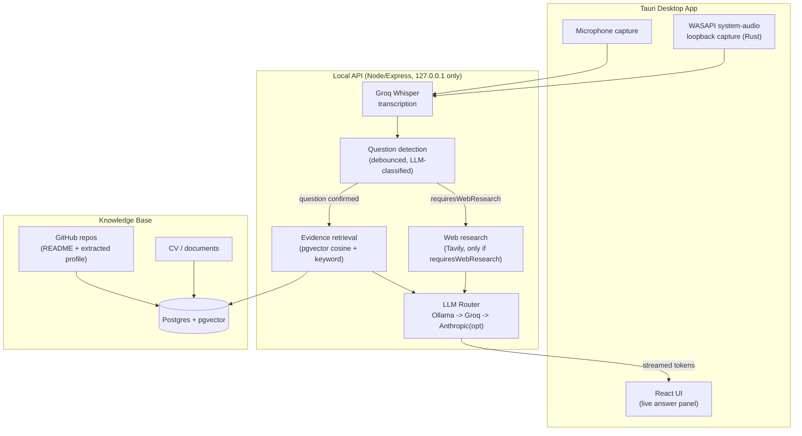

# Interview Copilot

A local-first, grounded AI system for **interview preparation and simulated interview practice**: it listens to a mock or explicitly-permitted interview, detects when the interviewer has asked a real question, retrieves your strongest relevant evidence from your own CV and GitHub projects, and generates a concise answer grounded in what you've actually done — never fabricating experience you don't have.


*Live session: a real answer to "Tell me about the MVNO Intelligence Hub project," grounded in the candidate's own CV and repo, with sources attached. An earlier version of this screenshot showed the interviewer's audio garbled beyond recognition — that was a real bug in fixed-duration chunking and a speed-tuned transcription model, not a feature; see [below](#interviewer-audio-accuracy-and-latency) for what changed.*



## What this is (and isn't)

This is built for **rehearsing answers grounded in your real experience** before a real interview, or for use in contexts where AI assistance during an interview is explicitly permitted — not for covertly answering a live interview where AI use isn't disclosed. The core engineering constraint — never fabricate experience you don't have — exists specifically because misrepresenting your background, AI-assisted or not, is the actual failure mode this project treats as unacceptable. See the [grounding policy](#grounding-policy) below for how that's enforced in code, not just prompted for.

## Grounding policy

1. Personal claims must come from your own knowledge base (CV, GitHub projects) — never invented.
2. The model may synthesize phrasing, but not invent experience, outcomes, or metrics that aren't in the source material.
3. Missing evidence → the answer says so plainly rather than guessing (verified in [evaluation](docs/eval/RESULTS.md): 0/3 no-evidence test questions fabricated a claim).
4. External/current facts (e.g. "what's new in Next.js") go through web research, gated by the question analyzer's `requiresWebResearch` flag — not asked on every question.
5. Web research never gets blended into personal evidence: retrieval always runs, but a question the analyzer flags as non-personal has to clear a higher evidence bar, so a current-events answer can't accidentally cite an unrelated CV line as a "source."

This is enforced in code: `packages/knowledge`'s evidence retrieval and `apps/api`'s `/api/answer` route both consult the question analyzer's output, and every "source" attached to an answer is built from the app's own retrieval — never trusted from client input. Two real bugs in this logic were found and fixed by actually running an evaluation, not by inspection — see [`docs/eval/RESULTS.md`](docs/eval/RESULTS.md) for the details, including a fix that initially over-corrected and was caught by a second independent eval run.

## How it works

1. **Prep, before the interview**: upload your CV, connect GitHub and select repos to ingest, optionally paste a job description for requirement matching and likely-question prep.
2. **During the interview**: click Start Listening. Your microphone and your system's audio output (whatever the interviewer's voice is playing through — Zoom, Google Meet, anything) are both transcribed in real time.
3. When the interviewer finishes a question (detected via a debounce + LLM classification, not fired on every audio fragment), the app retrieves your most relevant real evidence and streams a grounded, spoken-length answer for you to read.

## Screenshots

| Knowledge Base | GitHub ingestion |
|---|---|
|  |  |

| Job description matching |
|---|
|  |

## Evaluation

Measured against the real running app (not fabricated numbers) — see [`docs/eval/RESULTS.md`](docs/eval/RESULTS.md) for the full writeup, methodology, and the two real bugs it caught before they shipped.

| Metric | Result |
|---|---:|
| Question detection accuracy | 91.7%–100% across 3 runs |
| Retrieval hit rate (known-source questions) | 88.9%–100% across runs |
| No-evidence questions correctly declined (not fabricated) | 3/3 |
| Web-research questions with zero misattributed personal sources | 2/2 (after fix) |
| First-token latency (mean / median / P90) | 4.3s / 3.5s / 6.4s |
| Full-answer latency (mean / median / P90) | 6.0s / 5.8s / 9.5s |

The table above is the last full 3-run harness pass and predates the fixes described directly below — a fresh full pass with the new pipeline hasn't been run yet, so treat the numbers as the "before" baseline, not current behavior.

## Interviewer-audio accuracy and latency

The transcription/latency numbers above motivated a real rework, not just tuning:

- **Segmentation**: interviewer audio was chunked on a fixed 4-second clock, which sliced words at arbitrary boundaries (hurting accuracy) and forced every segment to wait out the full 4s even when the interviewer had already stopped talking (hurting latency). It's now voice-activity-segmented — `apps/desktop/src-tauri/src/loopback.rs` tracks RMS energy per 20ms frame and flushes a segment ~450ms after real speech stops, so a chunk is sent the moment there's a natural pause, not on a clock.
- **Transcription model**: switched from `whisper-large-v3-turbo` to `whisper-large-v3` (Groq) — the turbo variant trades accuracy for speed, and domain jargon/project names were exactly what it lost. A rolling context window of the session's own recent transcript is also passed as Whisper's `prompt` field, so a project name transcribed correctly once biases later segments toward getting it right again.
- **Live-path routing**: `/api/answer` and `/api/analyze-question` now use a Groq-only router with no local-model attempt (`includeLocalPool: false` in `createDefaultRouter`) — the local Ollama pool's cold-load time was the dominant tail latency in the table above, which is acceptable for prep-time generation (still local-first, to stay free) but not for a candidate visibly waiting on a live answer. Evidence retrieval and web research also now run concurrently instead of sequentially when a question needs both.
- **Grounding on the actual role**: the job description pasted on the Job Descriptions page is now persisted (`apps/desktop/src/lib/settings.ts`) and threaded into the live session's question analysis, answer generation, and transcription context — previously it lived only in that page's component state and never reached a live session at all.
- **Off-topic questions**: the answer prompt now explicitly requires the model to give the most useful honest answer available (reasoning from general knowledge, or the closest adjacent thing the evidence does support) rather than a bare "I don't have experience with that," so a tangential question still gets something substantive rather than a dead end.

Manual spot-check after these changes: the same live-answer path that measured 6.0s mean / 9.5s P90 full-answer latency in the table above now completes in ~1.9–2.0s on repeat calls (first call ~5.7s, cold). Not yet re-run through the full 3-pass harness — that's the next thing to do before updating the table itself.

No transcription pipeline is 100% accurate for every accent/audio path (Meet, Zoom, Teams, WhatsApp all encode differently, and real speakers vary far more than a clean test clip) — what changed here is architectural, not a guarantee. If a specific phrase still comes through wrong in a real session, the fix is almost always feeding more of that vocabulary into the rolling context (job description, company name, project names) rather than a model change.

## Security & scope

This is a **single-user, local-first desktop tool**, not a multi-tenant service:

- The API binds to `127.0.0.1` only — never reachable from outside the machine.
- All provider API keys (Groq, GitHub, Tavily) live server-side in `apps/api/.env`, never sent to the frontend.
- The GitHub token is held in an in-memory process variable, not persisted to disk or a database — process-local by design for a tool one person runs on their own machine.
- No candidate data is sent to any provider beyond what's needed for that specific request (transcription, embeddings, generation).

## Status

Actively in development. Working end-to-end, verified against the real running app (not just typechecked):

- Desktop shell (Tauri + React + Tailwind + shadcn/ui), packaged as a real Windows installer (MSI/NSIS) that auto-starts Postgres and the API server on launch
- Mic capture + native Windows (WASAPI) system-audio loopback capture, both transcribed via Groq Whisper
- Provider-agnostic LLM router with automatic failover (benchmarked local Ollama pool → Groq → optional Anthropic)
- Knowledge base: multi-file CV/document upload, chunking, local embeddings, Postgres/pgvector hybrid (semantic + keyword) retrieval
- GitHub repo ingestion (PAT or OAuth Device Flow), multi-repo bulk ingestion, README + structured project-profile extraction
- Job description parsing, hybrid requirement matching, strongest-story ranking, weak-area detection, likely questions, STAR story drafts
- Live session loop: question detection (debounced, noise-filtered) → grounded streaming answer
- Configurable response modes (direct / talking points / follow-up)
- Web research (Tavily), gated to only current-info questions

Known gaps: the live-pipeline latency/accuracy numbers in [Evaluation](#evaluation) predate the fixes in [Interviewer audio accuracy and latency](#interviewer-audio-accuracy-and-latency) and need a fresh harness run. Same-room speaker+mic test rigs still add acoustic cross-talk that headphones avoid entirely — that's a physical setup issue, not something software fixes. The OAuth Device Flow connect UI exists but a personal access token is the primary path today.

## Project structure

```
apps/
  desktop/    Tauri + React frontend
  api/        Local Node/Express backend (all provider API keys live here — never in the frontend)
packages/
  shared/     Shared TypeScript types
  ai/         LLM provider abstraction + router (Ollama/Groq/Anthropic)
  knowledge/  Document parsing, chunking, embeddings, retrieval, job matching
  database/   Postgres/pgvector client
  github/     GitHub ingestion (PAT or OAuth Device Flow)
  search/     Web research provider abstraction
  interview/  Live session orchestrator (question detection + answer loop)
  transcription/  Speech-to-text client (Groq Whisper)
docs/
  screenshots/  Real screenshots used above
  eval/         Evaluation harness, question sets, and results
infra/
  docker-compose.yml   Local Postgres + pgvector
  schema.sql           Database schema
```

## Setup

Requirements: Node 22+, Rust (for the Tauri/WASAPI native module), Docker
Desktop, and [Ollama](https://ollama.com) running locally.

```bash
npm install
cp .env.example apps/api/.env   # fill in at least GROQ_API_KEY
docker compose -f infra/docker-compose.yml up -d
docker exec -i interview-copilot-postgres psql -U interview_copilot -d interview_copilot < infra/schema.sql
ollama pull all-minilm          # embeddings
```

Run the backend and frontend in separate terminals:

```bash
npm run dev --workspace=apps/api
npm run tauri dev --workspace=apps/desktop
```

## License

MIT — see [LICENSE](LICENSE).
